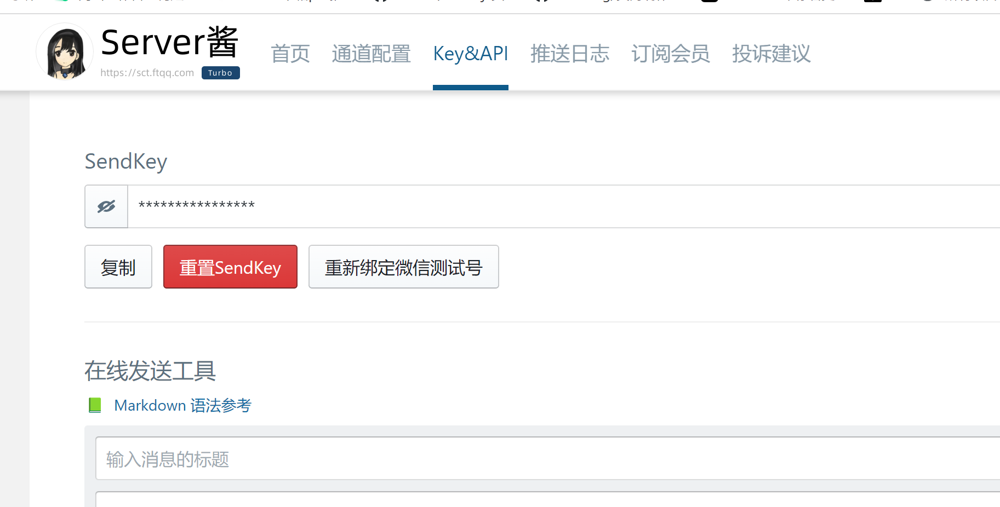
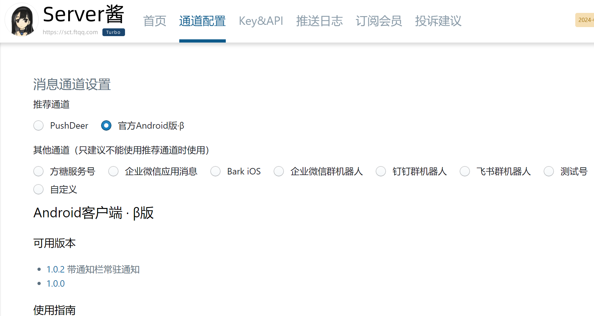

# 思路
check酱检查网页变动\
server酱推送消息\
server酱严重依赖微信，pushdeer想要将推送功能慢慢从微信隔离，但是效果一般

# fxd安装
环境：linux
执行命令
```bash
安装fxd-cli
首先使用终端进入你想要存放 fxd 代码的目录，没有可以创建一个，记为 FoldA。
npm install fxd-cli fxd-app-core 安装命令行和核心应用。
sudo ln -s $PWD/node_modules/fxd-cli/index.js /usr/local/bin/fxd 创建快捷命令。
(ps Windows 下建议使用 WSL 来运行)

Check酱2
进入 FoldA
npm install fxd-app-check-chan 安装Check酱2
sudo npx playwright install-deps 安装无头浏览器框架 playwright 依赖
```

# check酱
```bash
fxd checkChan --url="https://ftqq.com/" --selectors=".entry-title" --list=true
监控ftqq网站，css选择器为.entry-title的元素，如果有变动就推送至server酱
```
用自己的云服务器搭建一个网页，就监控最简单的h1标签，看能否推送网页变化消息至手机
```bash
cd /home/shuai/tmp_site
vim index.md

python3 -m http.server 6500
gxd checkChan --url="http://xxx.xx.xx.xx(云服务器ip地址):6500" --selectors="h1"，执行命令，当我们创建的h1标签内容变动时，手机appserver酱就会发出通知
```
```bash
$ fxd chakChan help

Version:
 1.0.24
Usage:
 fxd check-chan [command] [options]

Command - main|check|watch:
 --url <string>	要打开的页面 URL (required)
 --headless <boolean>	是否使用后台模式 (default: true)
 --selectors <string>	要检测的元素的 CSS 选择器,多个用逗号分隔 (default: body) (required)
 --prejs <string>	页面加载完成后执行的自定义 JavaScript 代码
 --prejs_args <string>	自定义 JavaScript 代码的参数
 --preplay <string>	页面加载完成后执行的自定义 Playwright 代码
 --timeout <number>	 Playwright 操作超时时间,单位毫秒 (default: 60000)
 --list <boolean>	 选择器是否返回元素列表 (default: false)
 --user <string>	浏览器使用的用户目录 (default: default)
 --format <string>	返回的数据格式 (default: text)
 --wait_type <string>	等待元素出现的方式 (default: domcontentloaded)

Command - watch:
 --sendkey <string>	填入后，检测到变化时会调用Server酱发消息
 --apprise_server_url <string>	apprise的Server URL；需安装 apprise 命令行以后才可使用
 --task_title <string>	显示在动态中，非命令行模式则无需填写
 --task_icon <string>	显示在动态中，非命令行模式则无需填写
 --feed_publish <boolean>	是否发布为Feed，将显示在动态页面 (default: false)
 --feed_as_public <boolean>	Feed 是否公开 (default: true)
```

# server酱
[server酱](https://sct.ftqq.com/sendkey)\
该网址微信登录，拿到key

通道用原生app，pushdeer不好使

原理是我们向server酱服务器发送消息，sever酱服务器通过具体通道传递消息

# ref
[fxd check酱](http://fxd-doc.ftqq.com/cmd.html#%E9%80%9A%E8%BF%87server%E9%85%B1%E5%8F%91%E9%80%81%E9%80%9A%E7%9F%A5)\
[pushdeer](https://www.pushdeer.com/dev.html)\
[server酱](https://sct.ftqq.com/sendkey)

