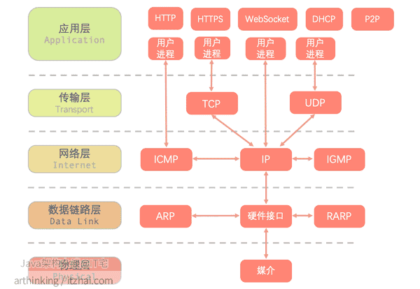

OS:Debian

# 前置准备
## 安装ubuntu
[rufus](https://rufus.ie/zh/)\
[ubuntu iso desktop](https://ubuntu.com/download/desktop)\
系统启动boot选择u盘即可
## 配置ubuntu
[linux config bash脚本](https://github.com/apeishuai/bash/tree/master/linux)


# 内核
```
uname

Usage: uname [OPTION]...
Print certain system information.  With no OPTION, same as -s.

  -a, --all                print all information, in the following order,
                             except omit -p and -i if unknown:
  -s, --kernel-name        print the kernel name
  -n, --nodename           print the network node hostname
  -r, --kernel-release     print the kernel release
  -v, --kernel-version     print the kernel version
  -m, --machine            print the machine hardware name
  -p, --processor          print the processor type (non-portable)
  -i, --hardware-platform  print the hardware platform (non-portable)
  -o, --operating-system   print the operating system
      --help        display this help and exit
      --version     output version information and exit

uname -rmi
```

内核安装及切换

# 硬件
```
lscpu：
查看CPU架构、核心数、线程数等信息。

lsblk：
列出所有可用的块设备（硬盘、SSD、USB闪存驱动器等）及其分区。

lspci：
显示所有PCI总线上的设备，包括显卡、网络卡、声卡等。

lsusb：
显示所有USB设备的信息。

lshw：
列出详细的系统硬件信息。使用-short选项可以获得简洁的输出。

dmidecode：
从系统的DMI（桌面管理接口）表中读取硬件信息，包括BIOS、系统、内存、CPU等。

inxi（可能需要安装）：
一个用户友好的命令行系统信息工具，提供详细的硬件信息。

hwinfo（可能需要安装）：
提供详细的硬件信息，包括CPU、内存、PCI设备等。

smartctl（需要安装smartmontools）：
用于查看硬盘的SMART（自监测、分析和报告技术）信息，用于监控硬盘健康状态。

ethtool：
用于查看和配置网络接口的参数，如速度、双工模式、统计信息等。

mtr（结合了ping和traceroute的功能）：
用于网络诊断，显示网络连接的详细信息。

nmap：
网络探测工具，可以用来扫描网络中的设备。

df：
显示文件系统的磁盘空间使用情况。

free：
显示内存使用情况。

vmstat：
显示关于系统内存、进程、中断、CPU活动等的统计信息。

iostat：
显示CPU和输入/输出设备的统计信息。

top或htop（需要安装）：
实时显示系统进程和资源使用情况。

ifconfig或ip addr：
显示网络接口的配置信息。

cat /proc/cpuinfo：
显示CPU的详细信息。

cat /proc/meminfo：
显示内存的详细信息。
这些命令为您提供了一个全面的系统硬件概览。根据您的需要，您可以选择使用这些命令中的一个或多个来获取所需的硬件信息。请注意，某些命令可能需要root权限才能访问所有信息。
```

# 包管理
```bash
os:Debian/Ubuntu

aptitude
apt
  |
  --->dpkg

os:centos/RHEL
yum
dnf
```
## yum
```bash

1. **更新软件包列表**：
yum check-update

2. **列出所有可更新的软件包**：
yum list updates

3. **安装软件包**：
yum install package_name

4. **卸载软件包**：
yum remove package_name

5. **更新特定软件包**：
yum update package_name

6. **搜索软件包**：
yum search keyword

7. **显示特定软件包的信息**：
yum info package_name

8. **列出已安装的软件包**：
yum list installed

9. **清理缓存**：
yum clean all

10. **列出已安装软件包的文件**：
yum list package_name

11. **查看软件包依赖关系**：
yum deplist package_name

12. **显示软件包提供的文件列表**：
yum provides file_name

```

## aptitude

```bash
aptitude [-x] xx
-d 仅下载软件包 
-D 显示安装包的依赖关系信息 
-f 修复损坏的软件包 
-F 设置搜索结果的格式 
-h 显示帮助信息 
-i 运行时执行安装操作 
-O 设置如何排列显示搜索结果 
-p 每一步操作都要求确认 
-q 不显示进度条 
-u 启动时下载新的软件包列表 
-v 显示版本信息 
-V 显示软件包的版本信息 
-w 设置搜索结果的格式宽度 
-y 所有询问均回答自动yes 
-Z 显示每个软件包的安装尺寸变化

autoclean 删除旧的已下载软件包文件 
changelog 显示一个软件包的变更日志 
clean 删除已下载的软件包文件 
download 下载软件包的.deb文件 
forbid-version 禁止软件包升级到某个指定版本 
hold 将软件包置于保持状态 
install 安装或升级软件包 
markauto 将软件包标记为自动更新 
purge 卸载软件包并删除其配置文件 
reinstall 重新安装指定的软件 
remove 卸载软件包 
search 依据名称搜索软件包 
show 显示一个软件包的详细信息 
unhold 取消软件包的保持状态 
unmarkauto 将软件包标记为手动安装 
update 升级软件包

```
## apt
```
apt
/etc/apt/sources.list
apt工具整合了apt-get和apt-cache命令
apt不能直接安装.deb文件

apt-get update -> apt update
apt-get upgrade
apt-get dist-upgrade
apt-get install xxx
apt-get remove xxx
apt-get autoremove

apt-cache
apt-cache search xxx
apt-cache show xxx
apt-cache depends xxx
```
## dpkg
```bash
dpkg --help

dpkg --list 'ddd*'
dpkg --listfiles foo 列出安装软件包foo所提供的文件
dpkg -S foo 获得名为foo的文件所属的软件包
dpkg --status xxx
dpkg --info xxx.deb
dpkg --install xxx.deb
dpkg --remove xxx
```
## 常用软件安装
```bash
安装ping工具：sudo apt install iputils-ping

安装arp工具：sudo apt install net-tools

安装ip工具：sudo apt install iproute2

```
# 服务
## dns解析
```
nslookup xxx

暴力修改dns，直接奏效
/etc/network/interfaces
service networking restart

/etc/resolvconf/resolv.conf.d/base
/etc/resolvconf/resolv.conf.d/tailbase
service resolvconf restart

vim /etc/resolv.conf
ln /etc/resolv.conf 发现是一条软链接

rm -rf /etc/resolv.conf
echo -e "nameserver 1.1.1.1" > /etc/resolv.conf //会导致系统不能使用网卡通过dhcp得到dns

resolvconf是一个ubuntu上管理配置本机dns地址的工具，不提供dns解析
resolvconf -a /run/resolvocnf/interface/systemd-resolved //软链接
resolvconf -u //更新/etc/resolv.conf文件内容

/etc/systemd/resolved.conf
/usr/lib/systemd/resolv.conf
/run/systemd/resolve/stub-resolv.conf
/run/systemd/resolve/resolv.conf
system-resolv --status
app-->linux api-->system-resolved-->globa dns, /etc/resolv.conf

终极大法
systemctl stop systemd-resolved.service
systemctl disable systemd-resolved.service
```
## 后台任务
```
& //加载一个命令最后，可以把这个命令放后台执行
ctrl+z //将一个前台的命令放到后台执行，并处于暂停状态
jobs //查看有多少正在运行的指令
fg %num //将后台中的命令调至前台运行
bg %num //将一个在后台暂停的命令，变成在后台继续执行
kill %num //终止进程
nohup //在退出账户、关闭终端之后继续运行相应的进程
```

## 定时任务 cron
```bash
cron [-u user] {-l | -r | -e}
cron [-u user] file

crontab -l //列出所登录账户下所有cron任务
grep -v "#" //过滤所有注释

crontab -e //创建定时任务
crontab -r //删除crontab文件

sudo grep cron /var/log/syslog | tail //查看cron执行日志


分 时 日 月 星期 要运行的命令

* * * * * myCommand //每1min执行一次指令
3,15 * * * * myCommand //每小时的第3和15min执行
3,15 8-11 * * * myCommand
3,15 8-11 */2  *  * myCommand //每隔2天的上午8点到11点的第三和第15min执行
3,15 8-11 * * 1 myCommand
30 21 * * * /etc/init.d/smb restart
```

# 环境信息
who\
env\
which\
lastlog\


# 档案权限与文件目录
```bash
因为 Linux 的开发者实在太多了，如果每个人都发展出属于自己的目录配置方法， 那么将可能会造成很多管理上的困扰。您能想象，您进入一个企业之后，所接触到的 Linux 目录配置方法竟然跟您以前学的完全不同吗？！很难想象吧～所以，后来就有所谓的 Filesystem Hierarchy Standard (FHS) 标准的出炉了(link. <鸟哥的linux私房菜>)


/ 根目录

/bin 二进制文件
	/usr/bin
	/usr/local/bin

/boot 启动linux时使用的一些核心文件
/data 
/dev 设备文件
/etc 存放系统管理所需的配置文件和子目录
	/etc/init.d/
	/etc/xinetd.d/
	/etc/X11
/home 用户的主目录
/lib 存放系统最基本的动态链接共享库和内核模块
	/usr/lib
	/usr/loval/lib
/lib32
/lib64
/libx32
/lost+found
/media
/mnt
/opt 存放第三方应用程序的可选软件包
/proc 虚拟文件系统，包含运行中的内核和进程信息
/root
/run 存储系统启动以来的信息，如当前登录的用户和运行中的守护进程的PID文件
/sbin
/srv
/swapfile
/sys
/tmp
/usr
/var 针对系统执行过程中，常态性变动的档案放置目录
	/var/cache
	/var/lib
	/var/log
	/var/lock
	/var/run
	/var/spool
```

# 磁盘与档案系统管理


# 网络

```bash
原理
OSI七层模型

物理层: xx\
数据链路层:ifconfig ethtool arp ip wireshark\
网络层:ping traceroute tcpdump iptables ip\
传输层:netstat tcpdump socat telnet (tcp udp) (端口号)\
会话层:ssh tcpdump\
表示层\
应用层: curl ssh ftp xxx\

netcat nmap mtr iperf tcpdump wireshark

网卡信息
$ ip link show
$ ifconfig -a

lspci | grep -i network
ethtool -i eth0
```
抓包流程
```bash
tshark -D (显示网卡)
tshark -i 网卡 -w test.pcap (捕获数据包)
tshark -r xx.pcap (读取数据包)
```

```练习


```

## nmap
```bash
Usage: nmap [Scan Type(s)] [Options] {target specification}

nmap localhost

-sT : 指定使用TCP连接扫描
-o : 尝试识别目标的操作系统

TARGET SPECIFICATION:
  Can pass hostnames, IP addresses, networks, etc.
  Ex: scanme.nmap.org, microsoft.com/24, 192.168.0.1; 10.0.0-255.1-254
  -iL <inputfilename>: Input from list of hosts/networks
  -iR <num hosts>: Choose random targets
  --exclude <host1[,host2][,host3],...>: Exclude hosts/networks
  --excludefile <exclude_file>: Exclude list from file
HOST DISCOVERY:
  -sL: List Scan - simply list targets to scan
  -sn: Ping Scan - disable port scan
  -Pn: Treat all hosts as online -- skip host discovery
  -PS/PA/PU/PY[portlist]: TCP SYN/ACK, UDP or SCTP discovery to given ports
  -PE/PP/PM: ICMP echo, timestamp, and netmask request discovery probes
  -PO[protocol list]: IP Protocol Ping
  -n/-R: Never do DNS resolution/Always resolve [default: sometimes]
  --dns-servers <serv1[,serv2],...>: Specify custom DNS servers
  --system-dns: Use OS's DNS resolver
  --traceroute: Trace hop path to each host
SCAN TECHNIQUES:
  -sS/sT/sA/sW/sM: TCP SYN/Connect()/ACK/Window/Maimon scans
  -sU: UDP Scan
  -sN/sF/sX: TCP Null, FIN, and Xmas scans
  --scanflags <flags>: Customize TCP scan flags
  -sI <zombie host[:probeport]>: Idle scan
  -sY/sZ: SCTP INIT/COOKIE-ECHO scans
  -sO: IP protocol scan
  -b <FTP relay host>: FTP bounce scan
PORT SPECIFICATION AND SCAN ORDER:
  -p <port ranges>: Only scan specified ports
    Ex: -p22; -p1-65535; -p U:53,111,137,T:21-25,80,139,8080,S:9
  --exclude-ports <port ranges>: Exclude the specified ports from scanning
  -F: Fast mode - Scan fewer ports than the default scan
  -r: Scan ports consecutively - don't randomize
  --top-ports <number>: Scan <number> most common ports
  --port-ratio <ratio>: Scan ports more common than <ratio>
SERVICE/VERSION DETECTION:
  -sV: Probe open ports to determine service/version info
  --version-intensity <level>: Set from 0 (light) to 9 (try all probes)
  --version-light: Limit to most likely probes (intensity 2)
  --version-all: Try every single probe (intensity 9)
  --version-trace: Show detailed version scan activity (for debugging)
SCRIPT SCAN:
  -sC: equivalent to --script=default
  --script=<Lua scripts>: <Lua scripts> is a comma separated list of
           directories, script-files or script-categories
  --script-args=<n1=v1,[n2=v2,...]>: provide arguments to scripts
  --script-args-file=filename: provide NSE script args in a file
  --script-trace: Show all data sent and received
  --script-updatedb: Update the script database.
  --script-help=<Lua scripts>: Show help about scripts.
           <Lua scripts> is a comma-separated list of script-files or
           script-categories.
OS DETECTION:
  -O: Enable OS detection
  --osscan-limit: Limit OS detection to promising targets
  --osscan-guess: Guess OS more aggressively
TIMING AND PERFORMANCE:
  Options which take <time> are in seconds, or append 'ms' (milliseconds),
  's' (seconds), 'm' (minutes), or 'h' (hours) to the value (e.g. 30m).
  -T<0-5>: Set timing template (higher is faster)
  --min-hostgroup/max-hostgroup <size>: Parallel host scan group sizes
  --min-parallelism/max-parallelism <numprobes>: Probe parallelization
  --min-rtt-timeout/max-rtt-timeout/initial-rtt-timeout <time>: Specifies
      probe round trip time.
  --max-retries <tries>: Caps number of port scan probe retransmissions.
  --host-timeout <time>: Give up on target after this long
  --scan-delay/--max-scan-delay <time>: Adjust delay between probes
  --min-rate <number>: Send packets no slower than <number> per second
  --max-rate <number>: Send packets no faster than <number> per second
FIREWALL/IDS EVASION AND SPOOFING:
  -f; --mtu <val>: fragment packets (optionally w/given MTU)
  -D <decoy1,decoy2[,ME],...>: Cloak a scan with decoys
  -S <IP_Address>: Spoof source address
  -e <iface>: Use specified interface
  -g/--source-port <portnum>: Use given port number
  --proxies <url1,[url2],...>: Relay connections through HTTP/SOCKS4 proxies
  --data <hex string>: Append a custom payload to sent packets
  --data-string <string>: Append a custom ASCII string to sent packets
  --data-length <num>: Append random data to sent packets
  --ip-options <options>: Send packets with specified ip options
  --ttl <val>: Set IP time-to-live field
  --spoof-mac <mac address/prefix/vendor name>: Spoof your MAC address
  --badsum: Send packets with a bogus TCP/UDP/SCTP checksum
OUTPUT:
  -oN/-oX/-oS/-oG <file>: Output scan in normal, XML, s|<rIpt kIddi3,
     and Grepable format, respectively, to the given filename.
  -oA <basename>: Output in the three major formats at once
  -v: Increase verbosity level (use -vv or more for greater effect)
  -d: Increase debugging level (use -dd or more for greater effect)
  --reason: Display the reason a port is in a particular state
  --open: Only show open (or possibly open) ports
  --packet-trace: Show all packets sent and received
  --iflist: Print host interfaces and routes (for debugging)
  --append-output: Append to rather than clobber specified output files
  --resume <filename>: Resume an aborted scan
  --stylesheet <path/URL>: XSL stylesheet to transform XML output to HTML
  --webxml: Reference stylesheet from Nmap.Org for more portable XML
  --no-stylesheet: Prevent associating of XSL stylesheet w/XML output
MISC:
  -6: Enable IPv6 scanning
  -A: Enable OS detection, version detection, script scanning, and traceroute
  --datadir <dirname>: Specify custom Nmap data file location
  --send-eth/--send-ip: Send using raw ethernet frames or IP packets
  --privileged: Assume that the user is fully privileged
  --unprivileged: Assume the user lacks raw socket privileges
  -V: Print version number
  -h: Print this help summary page.
EXAMPLES:
  nmap -v -A scanme.nmap.org
  nmap -v -sn 192.168.0.0/16 10.0.0.0/8
  nmap -v -iR 10000 -Pn -p 80
SEE THE MAN PAGE (https://nmap.org/book/man.html) FOR MORE OPTIONS AND EXAMPLES
```
## ip
```bash
1. 显示网络接口信息


ip link show：显示当前系统中的所有网络接口信息。

ip addr show：显示所有网络接口的IP地址和相关信息。

ip link show eth0：显示特定网络接口（例如eth0）的详细信息。


2. 配置网络接口


ip addr add 192.168.1.100/24 dev eth0：为网络接口eth0添加IP地址192.168.1.100，子网掩码为/24。

ip addr del 192.168.1.100/24 dev eth0：删除网络接口eth0上的指定IP地址。

ip link set dev eth0 up：启用网络接口eth0。

ip link set dev eth0 down：禁用网络接口eth0。


3. VLAN配置


ip link add link eth0 name eth0.20 type vlan id 20：创建一个名为eth0.20的VLAN接口，其VLAN ID为20，连接到物理接口eth0上。

ip link show type vlan：显示系统中所有的VLAN接口。

ip link delete dev eth0.20：删除指定的VLAN接口。


4. 路由配置


ip route show：显示系统中当前的路由表。

ip route add 192.168.2.0/24 via 192.168.1.1 dev eth0：添加一个到目标网络192.168.2.0/24的路由，下一跳为192.168.1.1，出接口为eth0。

ip route del 192.168.2.0/24：删除指定的路由。


5. 其他常用命令


ip neigh show：显示邻居（ARP）表信息。

ip tunnel add tun0 mode ipip remote 192.168.1.2 local 192.168.1.1：创建一个IP隧道。

ip link set dev eth0 mtu 1500：设置网络接口eth0的最大传输单元（MTU）为1500字节。
```
## ping 
```bash
Ping是一个常用的网络工具，用于测试主机之间的连通性。通过发送ICMP（Internet Control Message Protocol）数据包到目标主机，并接收目标主机返回的响应，可以检查网络连接是否正常、计算往返时间（Round-Trip Time，RTT）以及丢包率等信息。

以下是Ping命令的基本语法和常用选项：

ping [选项] 目标主机
常用选项包括：

- `-c <次数>`：指定发送数据包的次数。
- `-i <间隔>`：设置发送数据包的时间间隔。
- `-s <数据包大小>`：设置发送数据包的大小。
- `-W <超时时间>`：设置等待响应的超时时间。
- `-q`：以静默模式运行，只显示结果汇总。
- `-I`: interface
           interface is either an address, an interface name or a VRF name. If interface is an
           address, it sets source address to specified interface address. If interface is an
           interface name, it sets source interface to specified interface. If interface is a VRF
           name, each packet is routed using the corresponding routing table; in this case, the
           -I option can be repeated to specify a source address. NOTE: For IPv6, when doing ping
           to a link-local scope address, link specification (by the '%'-notation in destination,
           or by this option) can be used but it is no longer required.


示例用法：

1. Ping目标主机并持续发送数据包：

ping targethost

2. 指定发送数据包次数：

ping -c 5 targethost

3. 指定发送数据包大小：

ping -s 100 targethost

4. 设置发送数据包的时间间隔：

ping -i 2 targethost

5. 设置等待响应的超时时间：

ping -W 2 targethost

通过Ping命令可以快速检测网络的连通性，帮助诊断网络故障和调试网络配置。您可以根据具体的需求选择合适的选项和参数使用Ping命令。
```
## tcpdump
```bash
`tcpdump`是一个强大的网络数据包分析工具，用于捕获和分析网络数据包。下面是`tcpdump`的一些常用用法和参数：

1. **捕获网络数据包**：
   - `tcpdump`命令本身可以用来捕获网络数据包并在终端上显示，例如：
   tcpdump

2. **指定网络接口**：
   - 指定要捕获数据包的网络接口，例如`eth0`：
   tcpdump -i eth0

3. **指定协议**：
   - 通过指定协议来过滤数据包，如TCP、UDP等：
   tcpdump tcp

4. **指定端口**：
   - 通过指定源端口或目标端口来过滤数据包：
   tcpdump port 80

5. **保存数据包到文件**：
   - 将捕获的数据包保存到文件中以便后续分析：
   tcpdump -w capture.pcap

6. **读取保存的数据包文件**：
   - 读取保存的数据包文件进行分析：
   tcpdump -r capture.pcap

7. **显示数据包内容**：
   - 以十六进制和ASCII格式显示数据包内容：
   tcpdump -X

8. **显示数据包的时间戳**：
   - 显示捕获数据包的时间戳：
   tcpdump -tttt

9. **过滤数据包**：
   - 使用过滤器来只显示符合条件的数据包，如IP地址、协议、端口等：
   tcpdump host 192.168.1.1
```
## perf
perf is powerful: it can instrument CPU performance counters, tracepoints, kprobes, and uprobes (dynamic tracing). It is capable of lightweight profiling. It is also included in the Linux kernel, under tools/perf, and is frequently updated and enhanced.

基于ubuntu x86_64 v20.04安装perf
```bash
apt install linux-tools-common
apt install linux-tools-5.13.0-40-generic
apt install linux-cloud-tools-5.13.0-40-generic
```

```bash
perf -v
```

## tshark

```markdown
TShark (Wireshark) 4.2.3 (v4.2.3-0-ga15d7331476c)
Dump and analyze network traffic.
See https://www.wireshark.org for more information.

Usage: tshark [options] ...

Capture interface:
  # -i <interface>, --interface <interface>
                           name or idx of interface (def: first non-loopback)
  # -f <capture filter>      packet filter in libpcap filter syntax
  -s <snaplen>, --snapshot-length <snaplen>
                           packet snapshot length (def: appropriate maximum)
  -p, --no-promiscuous-mode
                           don t capture in promiscuous mode

  -I, --monitor-mode       capture in monitor mode, if available
  -B <buffer size>, --buffer-size <buffer size>
                           size of kernel buffer (def: 2MB)
  -y <link type>, --linktype <link type>
                           link layer type (def: first appropriate)
  --time-stamp-type <type> timestamp method for interface
  -D, --list-interfaces    print list of interfaces and exit
  -L, --list-data-link-types
                           print list of link-layer types of iface and exit
  --list-time-stamp-types  print list of timestamp types for iface and exit
  --update-interval        interval between updates with new packets (def: 100ms)

Capture stop conditions:
  -c <packet count>        stop after n packets (def: infinite)
  -a <autostop cond.> ..., --autostop <autostop cond.> ...
                           duration:NUM - stop after NUM seconds
                           filesize:NUM - stop this file after NUM KB
                              files:NUM - stop after NUM files
                            packets:NUM - stop after NUM packets
Capture output:
  -b <ringbuffer opt.> ..., --ring-buffer <ringbuffer opt.>
                           duration:NUM - switch to next file after NUM secs
                           filesize:NUM - switch to next file after NUM KB
                              files:NUM - ringbuffer: replace after NUM files
                            packets:NUM - switch to next file after NUM packets
                           interval:NUM - switch to next file when the time is
                                          an exact multiple of NUM secs

RPCAP options:
  -A <user>:<password>     use RPCAP password authentication

Input file:
  # -r <infile>, --read-file <infile>
                           set the filename to read from (or '-' for stdin)

Processing:
  -2                       perform a two-pass analysis
  -M <packet count>        perform session auto reset
  -R <read filter>, --read-filter <read filter>
                           packet Read filter in Wireshark display filter syntax
                           (requires -2)
  # -Y <display filter>, --display-filter <display filter> (packet)
                           packet displaY filter in Wireshark display filter
                           syntax
  -n                       disable all name resolutions (def: "mNd" enabled, or
                           as set in preferences)
  -N <name resolve flags>  enable specific name resolution(s): "mnNtdv"
  -d <layer_type>==<selector>,<decode_as_protocol> ...
                           "Decode As", see the man page for details
                           Example: tcp.port==8888,http
  -H <hosts file>          read a list of entries from a hosts file, which will
                           then be written to a capture file. (Implies -W n)
  --enable-protocol <proto_name>
                           enable dissection of proto_name
  --disable-protocol <proto_name>
                           disable dissection of proto_name
  --only-protocols <protocols>
                           Only enable dissection of these protocols, comma
                           separated. Disable everything else
  --disable-all-protocols
                           Disable dissection of all protocols
  --enable-heuristic <short_name>
                           enable dissection of heuristic protocol
  --disable-heuristic <short_name>
                           disable dissection of heuristic protocol
Output:
  -w <outfile|->           write packets to a pcapng-format file named "outfile"
                           (or '-' for stdout)
  --capture-comment <comment>
                           add a capture file comment, if supported
  -C <config profile>      start with specified configuration profile
  -F <output file type>    set the output file type, default is pcapng
                           an empty "-F" option will list the file types
  -V                       add output of packet tree        (Packet Details)
  -O <protocols>           Only show packet details of these protocols, comma
                           separated
  -P, --print              print packet summary even when writing to a file
  -S <separator>           the line separator to print between packets
  -x                       add output of hex and ASCII dump (Packet Bytes)
  --hexdump <hexoption>    add hexdump, set options for data source and ASCII dump
     all                   dump all data sources (-x default)
     frames                dump only frame data source
     ascii                 include ASCII dump text (-x default)
     delimit               delimit ASCII dump text with '|' characters
     noascii               exclude ASCII dump text
     help                  display help for --hexdump and exit
  -T pdml|ps|psml|json|jsonraw|ek|tabs|text|fields|?
                           format of text output (def: text)
  -j <protocolfilter>      protocols layers filter if -T ek|pdml|json selected
                           (e.g. "ip ip.flags text", filter does not expand child
                           nodes, unless child is specified also in the filter)
  -J <protocolfilter>      top level protocol filter if -T ek|pdml|json selected
                           (e.g. "http tcp", filter which expands all child nodes)
  -e <field>               field to print if -Tfields selected (e.g. tcp.port,
                           _ws.col.info)
                           this option can be repeated to print multiple fields
  -E<fieldsoption>=<value> set options for output when -Tfields selected:
     bom=y|n               print a UTF-8 BOM
     header=y|n            switch headers on and off
     separator=/t|/s|<char> select tab, space, printable character as separator
     occurrence=f|l|a      print first, last or all occurrences of each field
     aggregator=,|/s|<char> select comma, space, printable character as
                           aggregator
     quote=d|s|n           select double, single, no quotes for values
  -t (a|ad|adoy|d|dd|e|r|u|ud|udoy)[.[N]]|.[N]
                           output format of time stamps (def: r: rel. to first)
  -u s|hms                 output format of seconds (def: s: seconds)
  -l                       flush standard output after each packet
  -q                       be more quiet on stdout (e.g. when using statistics)
  -Q                       only log true errors to stderr (quieter than -q)
  -g                       enable group read access on the output file(s)
  -W n                     Save extra information in the file, if supported.
                           n = write network address resolution information
  -X <key>:<value>         eXtension options, see the man page for details
  -U tap_name              PDUs export mode, see the man page for details
  -z <statistics>          various statistics, see the man page for details
  --export-objects <protocol>,<destdir>
                           save exported objects for a protocol to a directory
                           named "destdir"
  --export-tls-session-keys <keyfile>
                           export TLS Session Keys to a file named "keyfile"
  --color                  color output text similarly to the Wireshark GUI,
                           requires a terminal with 24-bit color support
                           Also supplies color attributes to pdml and psml formats
                           (Note that attributes are nonstandard)
  --no-duplicate-keys      If -T json is specified, merge duplicate keys in an object
                           into a single key with as value a json array containing all
                           values
  --elastic-mapping-filter <protocols> If -G elastic-mapping is specified, put only the
                           specified protocols within the mapping file
  --temp-dir <directory>   write temporary files to this directory
                           (default: D:\softwares\msys64\tmp)

Diagnostic output:
  --log-level <level>      sets the active log level ("critical", "warning", etc.)
  --log-fatal <level>      sets level to abort the program ("critical" or "warning")
  --log-domains <[!]list>  comma-separated list of the active log domains
  --log-fatal-domains <list>
                           list of domains that cause the program to abort
  --log-debug <[!]list>    list of domains with "debug" level
  --log-noisy <[!]list>    list of domains with "noisy" level
  --log-file <path>        file to output messages to (in addition to stderr)

Miscellaneous:
  -h, --help               display this help and exit
  -v, --version            display version info and exit
  -o <name>:<value> ...    override preference setting
  -K <keytab>              keytab file to use for kerberos decryption
  -G [report]              dump one of several available reports and exit
                           default report="fields"
                           use "-G help" for more help

```
```bash
过滤：

过滤值比较符号
eq ==
ne !=
gt >
lt <
ge >=
le <=
contain 包含
matches ~ 正则匹配
bitwise_and & 位与操作 tcp.flags & 0x02

多个表达式间的组合
and &&
or ||
xor ^^
not !
[...]
in

针对ip
ip.src == 192.168.0.1
ip.dst == 192.168.0.1
ip.addr == 192.168.0.1
!(ip.addr == 192.168.0.1)


针对协议
http pr telnet
not arp  !tcp

针对端口
tcp.port == 80
udp.port >= 2048

针对长度和内容
udp.length < 20
http.content_length <= 30

http.request.uri matches "user"
http.request.uri contains "User"

http.host contains "baidu"
http.content_type == "text/html"
http.cookie contains "userid"


>常用指令
tshark -i eth0 -f "ip.src == 192.168.1.100 and tcp.port == 80"
```


# 用户管理
```相关文件
/etc/passwdS\
root:x:0:0::/root:/bin/bash\
name: :user id:gid:directory:bash\
(gid:一登陆就会自动获得，初始群组)

/etc/shadow\
root:xxxxx:13025:5:60:7:2:13125:\
name:pass:最近密码更新日期:密码不可被更改天数:密码需要重新变更天数:密码需要变更期限前警告:密码过期恕限时间:账号失效日期:保留\

/etc/group\
root:x:0:root\
gname:pass:gid:support account

/etc/gshadow\
root:::root\
user:pass(!xx表示无法登入):group account:群组所属账号

/home/username
```

```操作命令
groupadd\
groupmod\
groupdel\
gpasswd\

newgrp users: 切换有效群组(决定新创建文件归属)\
exit: 离开新的有效群组

groups:查看账号属于的群组(第一个为有效群组)
```
```指令执行后相关文件改动
useradd:(相关文件改动)\
ref: \
/etc/default/useradd\
/etc/login.defs\
/etc/skel/*

passwd:
/etc/login.defs\
/etc/pam.d/passwd\

usermod:

userdel:\
/etc/passwd\
/etc/shadow\
/home/username\

sudo \
/etc/sudoer

PAM模块：\
/etc/nologin, /etc/securetty\
/etc/pam.d\
```
当前信息查看
```
awk -F: '{print $1}' /etc/passwd
```

```练习

```

# bash命令
## awk
```bash
awk [options] 'pattern {action}' filename

Program:
    The -f option value is the name of a file containing program text.
    If no -f option is given, a "--" ends option processing; the following
    parameters are the program text.

Options:
    -f program-file  Program  text is read from file instead of from the
                     command-line.  Multiple -f options are accepted.
    -F value         sets the field separator, FS, to value.
    -v var=value     assigns value to program variable var.
    --               unambiguous end of options.

    Implementation-specific options are prefixed with "-W".  They can be
    abbreviated:

    -W version       show version information and exit.
    -W dump          show assembler-like listing of program and exit.
    -W help          show this message and exit.
    -W interactive   set unbuffered output, line-buffered input.
    -W exec file     use file as program as well as last option.
    -W random=number set initial random seed.
    -W sprintf=number adjust size of sprintf buffer.
    -W posix_space   do not consider "\n" a space.
    -W usage         show this message and exit.
```
# Ref
https://qref.sourceforge.net/Debian/reference/index.zh-cn.html#contents
