# simen(西门子)
## 型号：smart 200
## IO分配
## 地址及数据类型
## 指令

## 型号：tia 1200
## IO分配
## 地址及数据类型
## 指令

# 三菱
## 型号
## IO分配
## 地址及数据类型
## 指令

# ormon(欧姆龙)
[ormon plc仿真环境搭建及通信](https://blog.csdn.net/yjg428/article/details/130483821)

(ormon sysmac cp1h)
## 型号
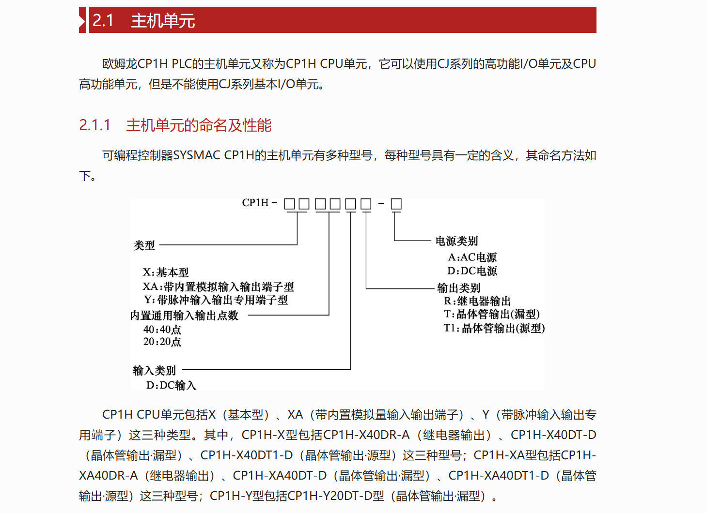
## IO分配

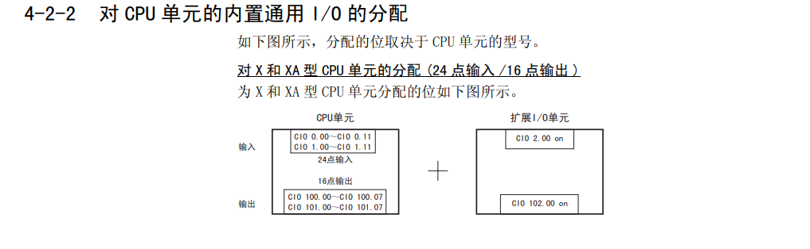
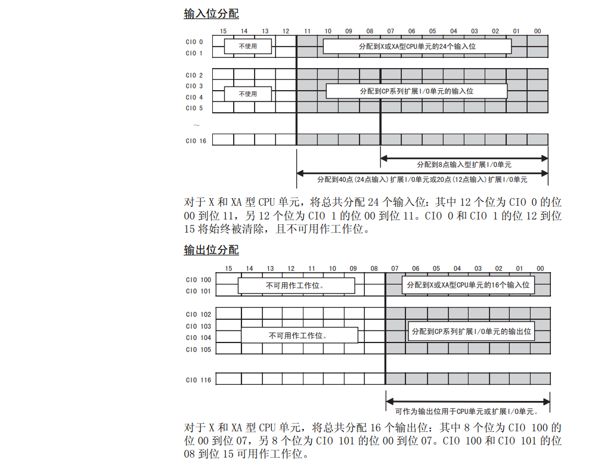

## 地址及数据类型
### 寻址方式
#### 变址寻址
#### 固定地址
保持区H\
范围：H0.00-->H511.15

数据存储器D\
范围：D0-->D32767

##### IO存储区
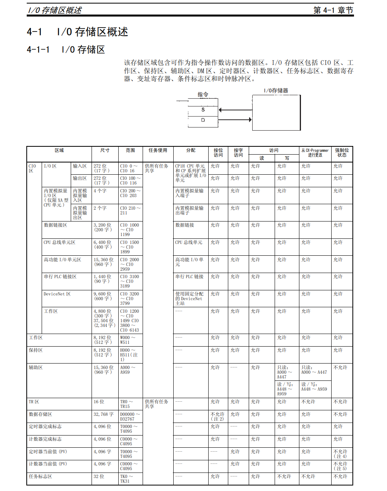
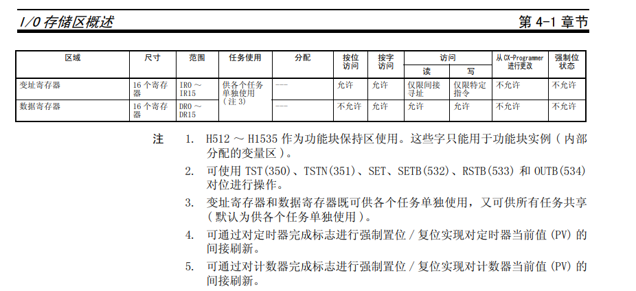
##### 数据区
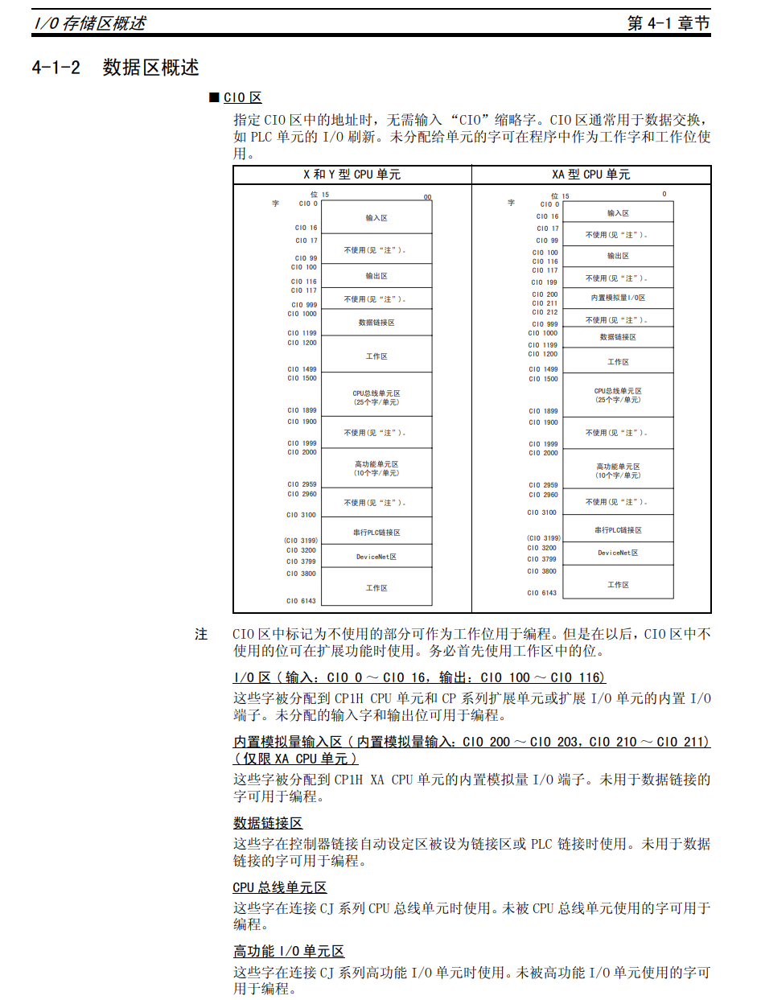
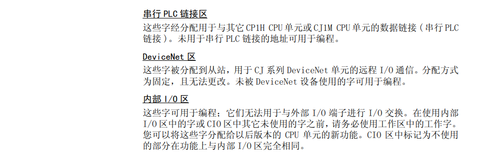
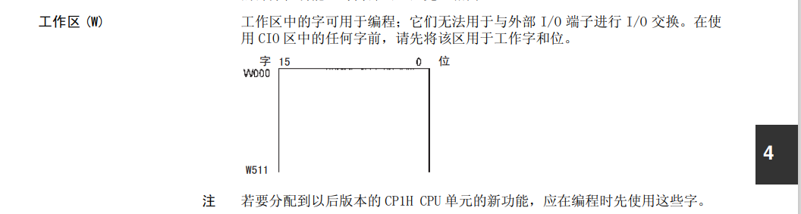
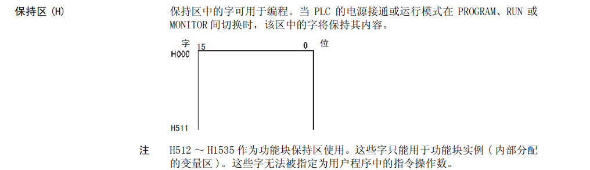
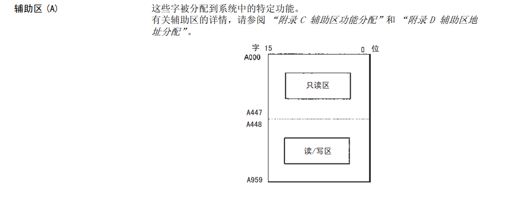
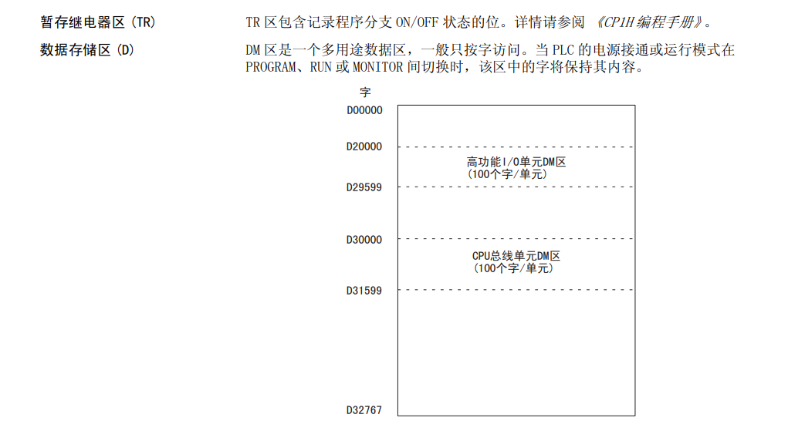
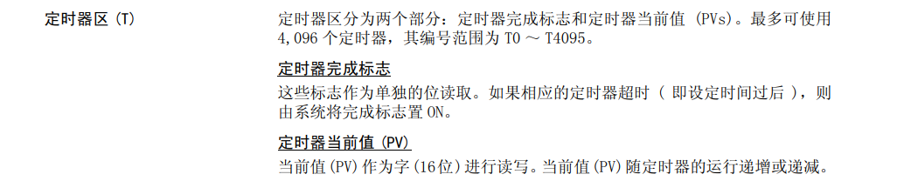
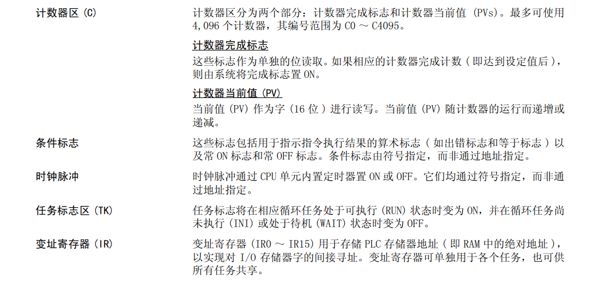

## 指令
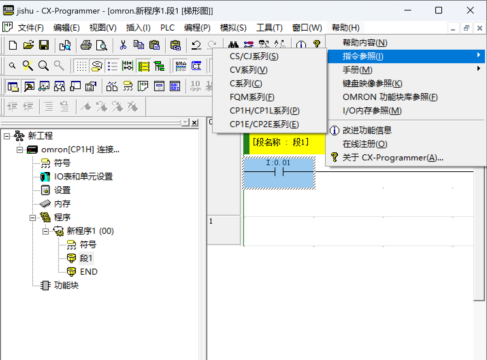
### 高速计数器

# ref
[ormon sysmac cp1h handbook](https://www.jianguoyun.com/p/DTzP450Q5rjkDBjrgNAFIAA)\
