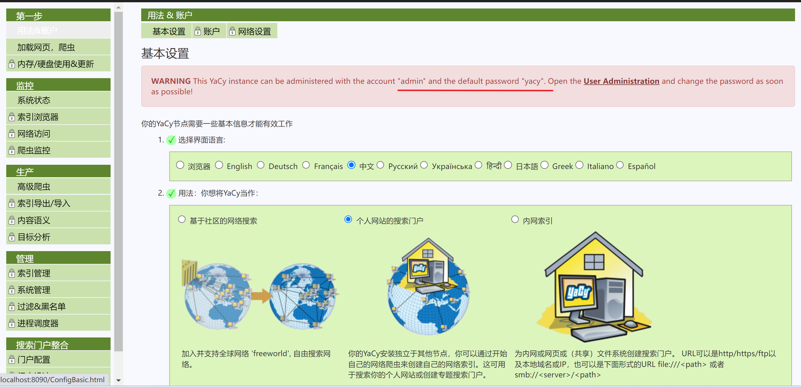
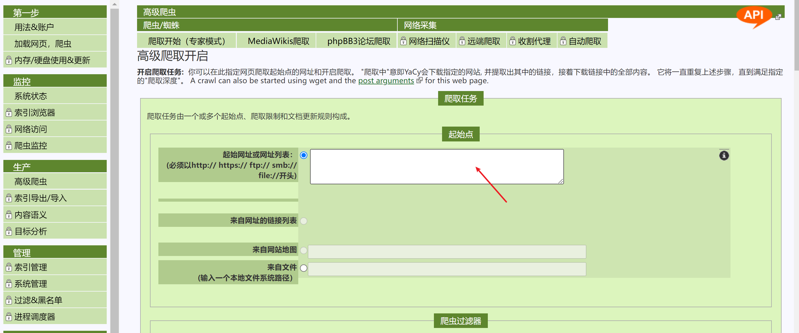
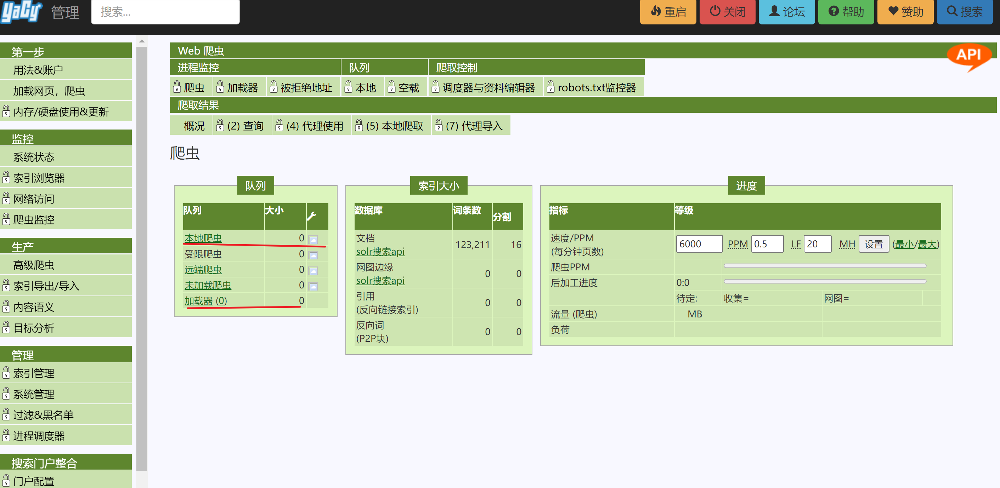

安装docker、安装wsl2，执行该脚本即可
# docker安装
```bash
docker run -d --name yacy_search_server -p 8090:8090 -p 8443:8443 -v yacy_search_server_data:/opt/yacy_search_server/DATA --restart unless-stopped --log-opt max-size=200m --log-opt max-file=2 yacy/yacy_search_server:latest

这个脚本是用于在 Docker 中运行 YaCy 搜索服务器（YaCy Search Server）的命令。让我逐步解释这个脚本中的各个参数和选项：
docker run：这是 Docker 命令，用于在容器中运行一个新的容器。
-d：这个选项表示在后台运行容器（detached 模式），即容器会在后台运行而不会占用当前终端。
--name yacy_search_server：这个选项指定了容器的名称为 yacy_search_server，方便后续对容器进行管理和操作。
-p 8090:8090 和 -p 8443:8443：这两个选项指定了容器内部端口和主机（宿主机）之间的映射关系。容器内的端口 8090 映射到主机的端口 8090，容器内的端口 8443 映射到主机的端口 8443，这样可以通过主机的这两个端口访问 YaCy 搜索服务器。
-v yacy_search_server_data:/opt/yacy_search_server/DATA：这个选项指定了容器内的一个数据卷挂载。将主机上的 yacy_search_server_data 卷挂载到容器内的 /opt/yacy_search_server/DATA 目录，这样可以在主机和容器之间共享数据。
--restart unless-stopped：这个选项指定了容器在退出时会自动重启，除非手动停止容器。
--log-opt max-size=200m --log-opt max-file=2：这两个选项指定了容器的日志设置。max-size=200m 表示单个日志文件的最大大小为 200MB，max-file=2 表示最多保留两个日志文件。
yacy/yacy_search_server:latest：这是要运行的容器的镜像名称和标签。在这里使用的是 YaCy 搜索服务器的最新版本。
```
# 使用
本地浏览器打开"127.0.0.1:8090"，如果部署到远程服务器，打开相应ip:port\
登录初始化账号

批量输入想要爬取的网址

监控爬虫状态，可以随时终止

其他的一些定制化工作就不用做了\
检索测试效果

# ref
[yacy website](https://yacy.net/)
