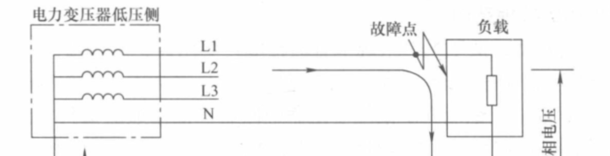
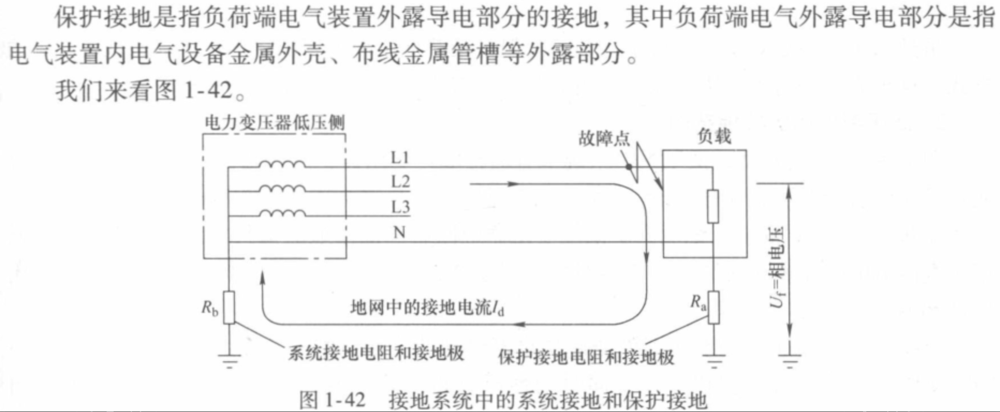
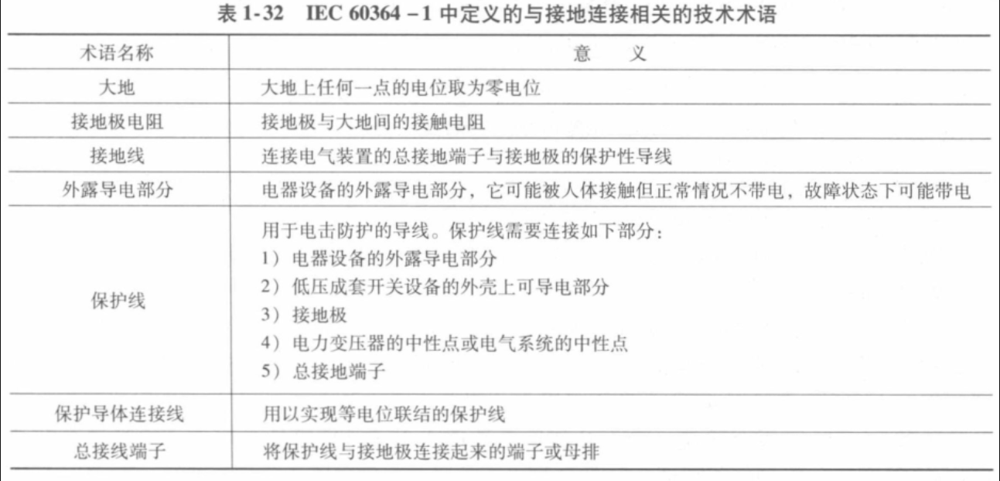
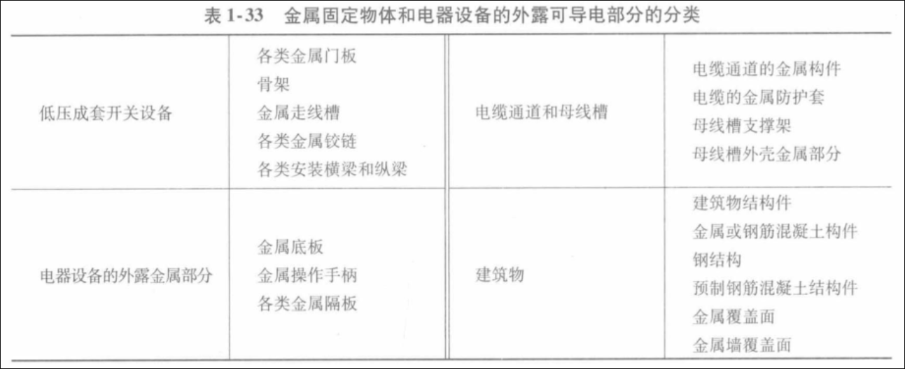
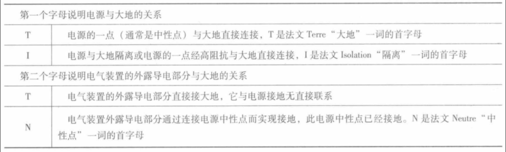
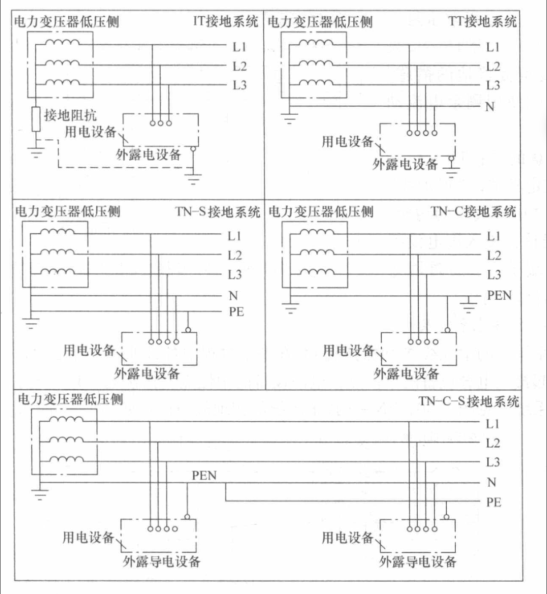

# 低压配电网

## 浪涌
## 短路

# 接地

如图，

## 系统接地

如图：雷电浪涌会在电路中产生极大的瞬态电流 \
电源端接地，瞬态电流绕着大地回到电源负极，起到了对负载电器的保护作用

## 中性线接地(保护接地)
[楼宇小区供电系统接地方式分析（TN-S系统）](https://www.bilibili.com/video/BV1Y2421w7dx/?spm_id_from=333.337.search-card.all.click&vd_source=5f0df1465c2a6217cdfee2c39bf1d4db)

中性线N取自于电力变压器低压侧按星形联结的三项绕组公共端。中性线N和相线一同为使用相电压的负载提供电能，同时中性线上也流过三相系统中的不平衡和单项电流。\
保护线PE则取自于接地点，其用途是保护人身安全，一般用于连接带电负荷的金属外壳、构架等，以及平时可能不带电但发生故障时可能带电的设备外露可导电部分。\
IEC标准规定自变压器中性线引出的PEN线(或N线)必须绝缘，并只能在低压配电盘内一点与接地的PE母排连接而实现系统接地，在这点以外任何之处不得再次接地，否则将有部分中性线电流通过非正规路径返回电源。\
IEC规定包含PE线的PEN线上不允许装设开关和熔断器以杜绝PE线被切断。

## 接地系统

低压配电网考虑三个问题：\
1 电气系统中的中性线及电器设备外露导电部分与接地极的连接方式\
2 采用专用的PE保护线还是采用与中性线合一的PEN保护线\
3 采用只能切断较大故障电流的过流保护电器还是采用能检测和切断较小的剩余电流的保护电器作为低压成套开关的接地故障防护

### TN系统
特征：\
1 强制性要求将用电设备外露导电部分和中性点接通并接地\
2 TN接地系统中的单相接地故障被放大为短路故障\
3 在TN接地系统中发生第一次接地故障时就能切断电源

TN系统属于大电流接地系统，因此在TN系统下可利用断路器或熔断器的短路保护作用来执行给单项接地故障保护

#### TN-C(combine)
特征：能同时承载三相不平衡电流和高次谐波电流。为此，TN-C的PEN线应当在用电设备内与若干接地极相连。\
TN-C系统的PEN线定义中，“保护线”功能优于“中性线”功能，所以PEN线首先接入用电设备的接地接线端子，然后再用连接片接到中性线端子。

#### TN-S()

## ref
<低压成套开关设备的原理及其控制技术.pdf>
