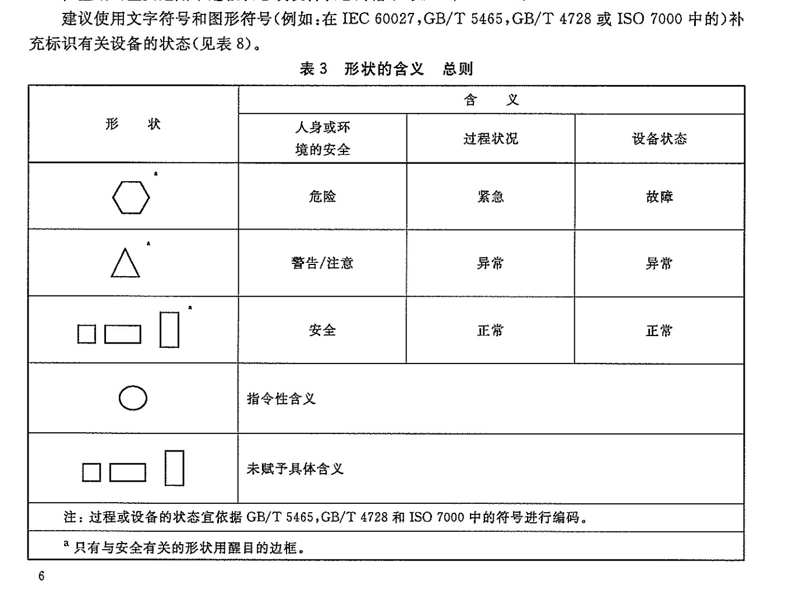
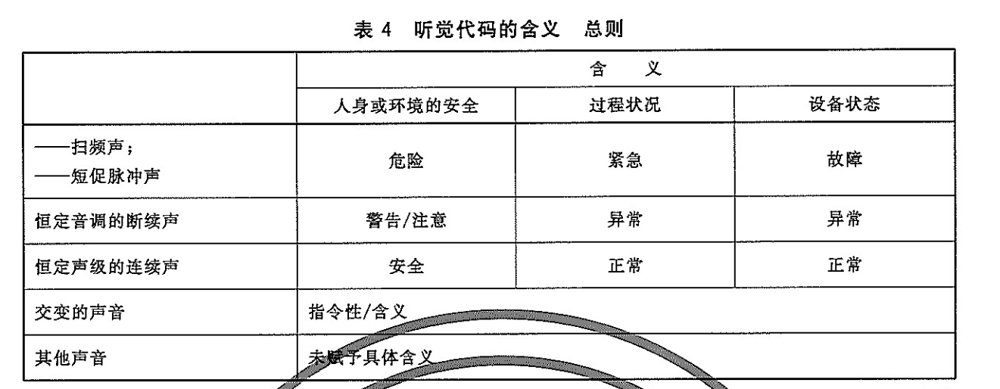
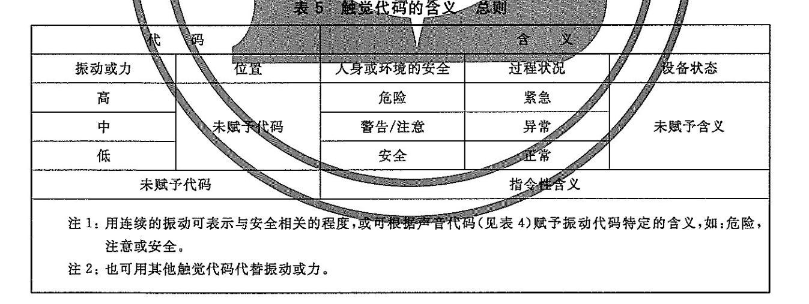
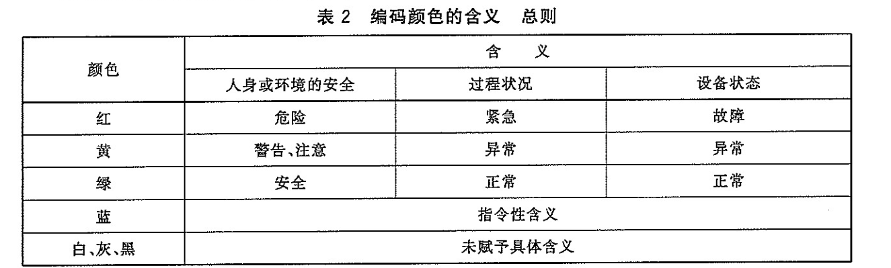
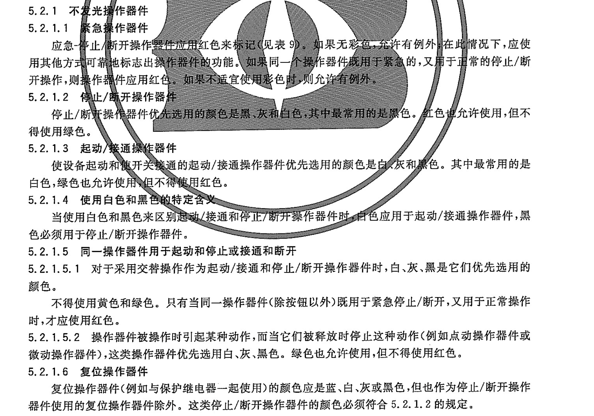
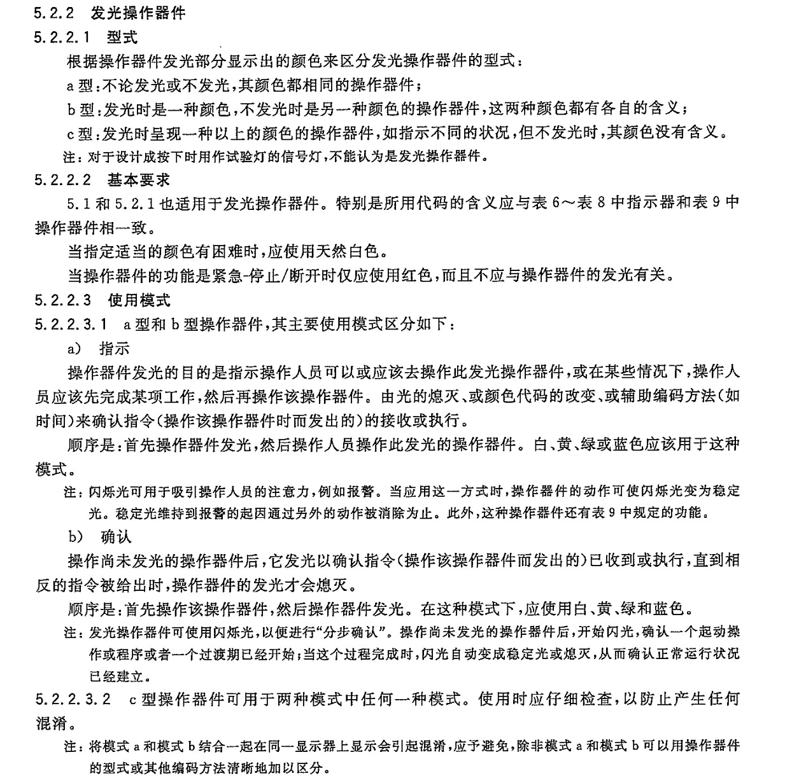

# 标识
[GB∕T 4026-2019 人机界面标志标识的基本和安全规则设备端子、导体终端和导体的标识](https://www.jianguoyun.com/p/DR59jPAQmdvgDBjJ_9kFIAA)\
[GBT 4025-2010 人机界面标志标识的基本和安全规则 指示器和操作器件的编码规则](https://www.jianguoyun.com/p/DfOXUVMQmdvgDBjQ_9kFIAA)

下列颜色允许用于导体的标识：\
黑色、棕色、红色、橙色、黄色、绿色、蓝色、紫色、灰色、白色、粉红色、青绿色

颜色标识应在终端和导体全长使用，并推荐在导体全场采用绝缘颜色或颜色标志。在终端和连接点使用颜色标识的裸导体除外

## 单色使用
中性或中间导体：推荐使用不饱和蓝色\
交流系统：优先使用黑色、棕色、灰色\
直流系统：线导体正极用红色，负极用白色\
功能接地：优先使用粉红色

## 双色组合
保护导体：绿-黄双色组合，(在颜色的标识别的任一15mm长导体上，一种颜色覆盖导体表面的30%~70%)

## 文字标识
中性导体:N\
保护导体:PE\
PEN导体:PEN\
PEL\
PEM\
保护联结导体:PB\
线导体：\
"L"开头，后缀:\
--交流电路，从数字"1"开始顺序编号\
--直流电路，在正极端加标识"+"，负极端加"-"

## 位置编码
1 作为主代码\
2 作为主代码的辅助代码，例如，形状代码作为颜色代码的补充\
位置代码主要用于过程状态和设备状态指示

## 其他编码

## 不发光操作器件

## 发光操作器件

