# 电线电缆
search in 国家标准网: 450/750 电线 \
指定电线电缆标准的组织为：全国电线电缆标准化技术委员会 \
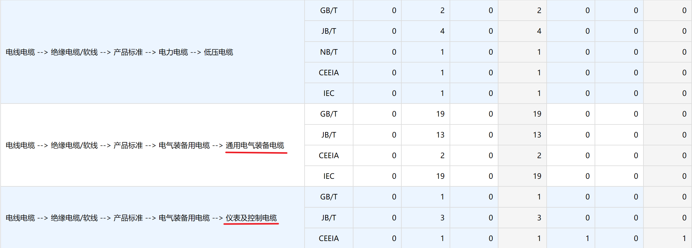

依据标准：GB5023.x 额定电压450∕750V及以下聚氯乙烯绝缘电缆\

[统计局产品名册--电线电缆](https://www.stats.gov.cn/sj/tjbz/tjypflml/2010/39/3909.html)
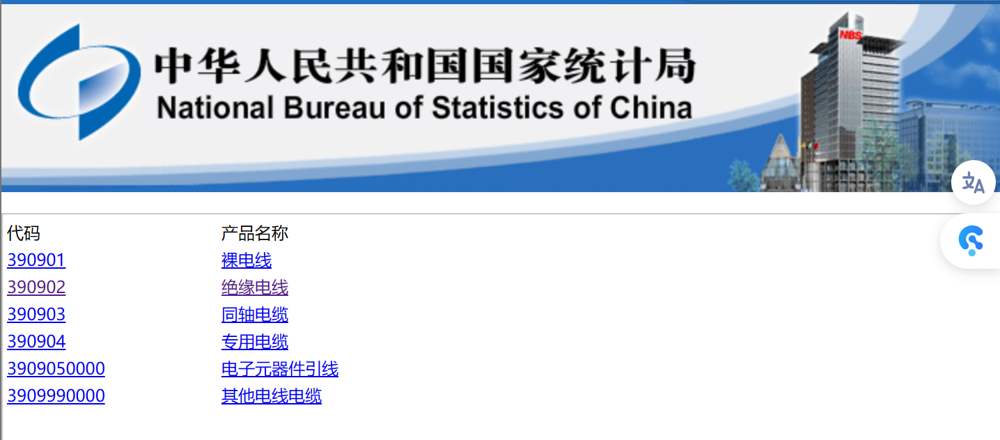

## 电气装备用电线电缆
### 型号
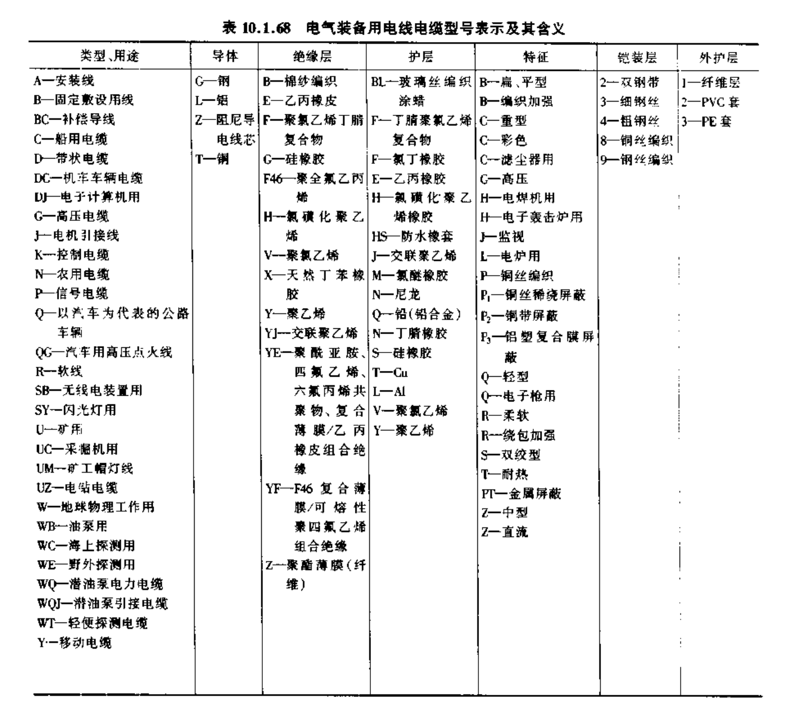
### 产品
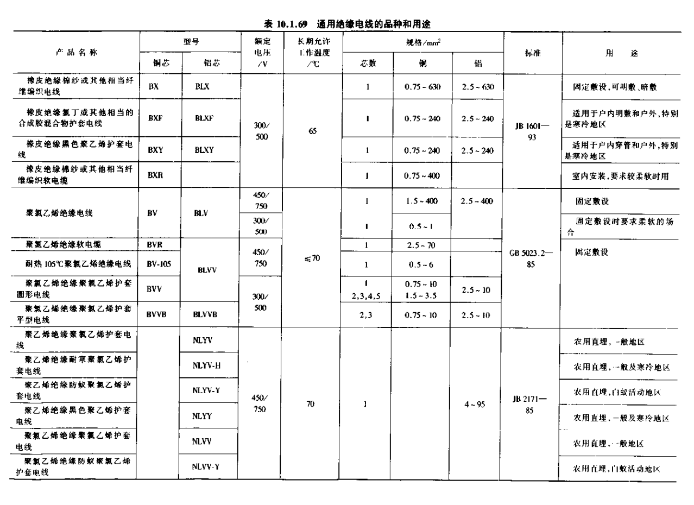
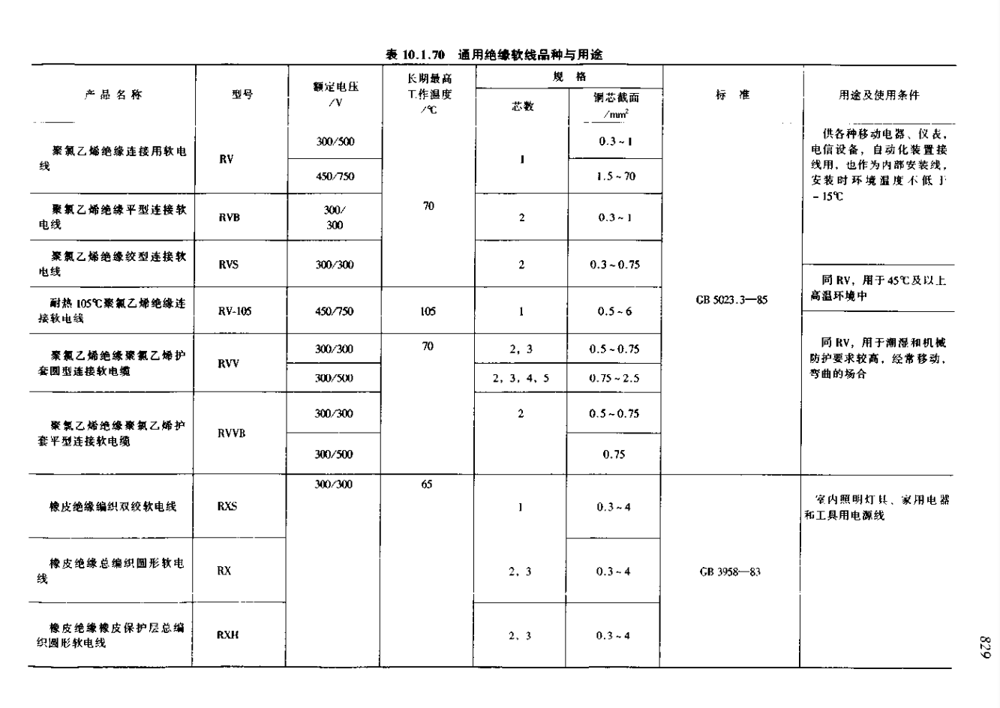

## 绝缘导线
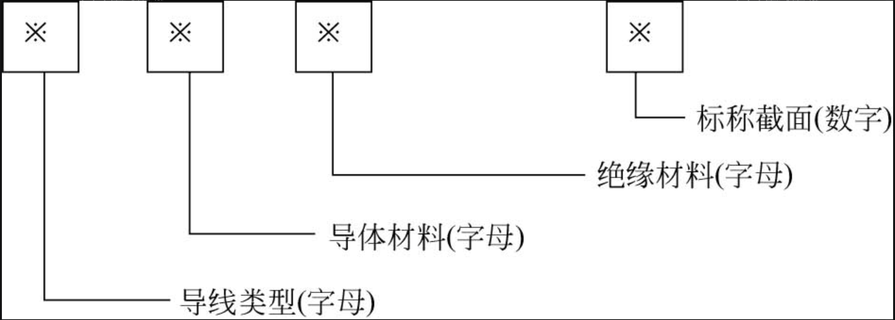
绝缘导线型号定义:
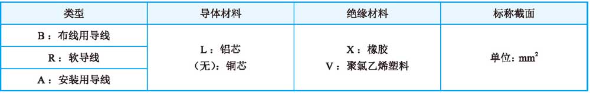

现场电线型号：\
RV AVVR	

## 截面积计算
在不需考虑允许的电压损失和导线机械强度的一般情况下，可只按导线的允许截流量来选择导线的面积

有两种计算方式：\
1· 查表 \
裸电线：
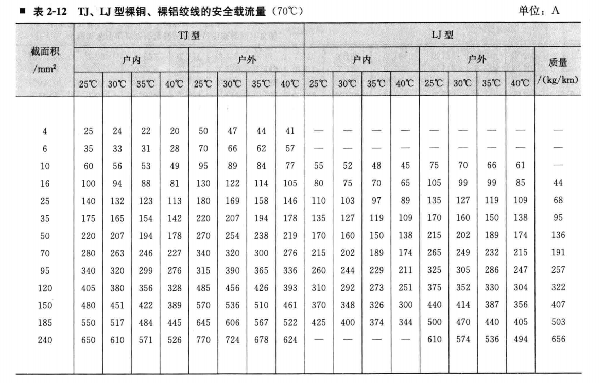
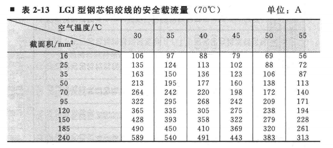
绝缘导线：
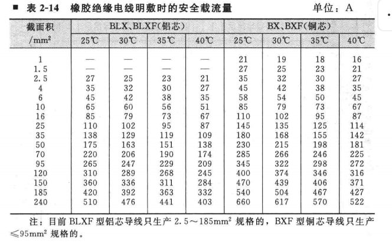
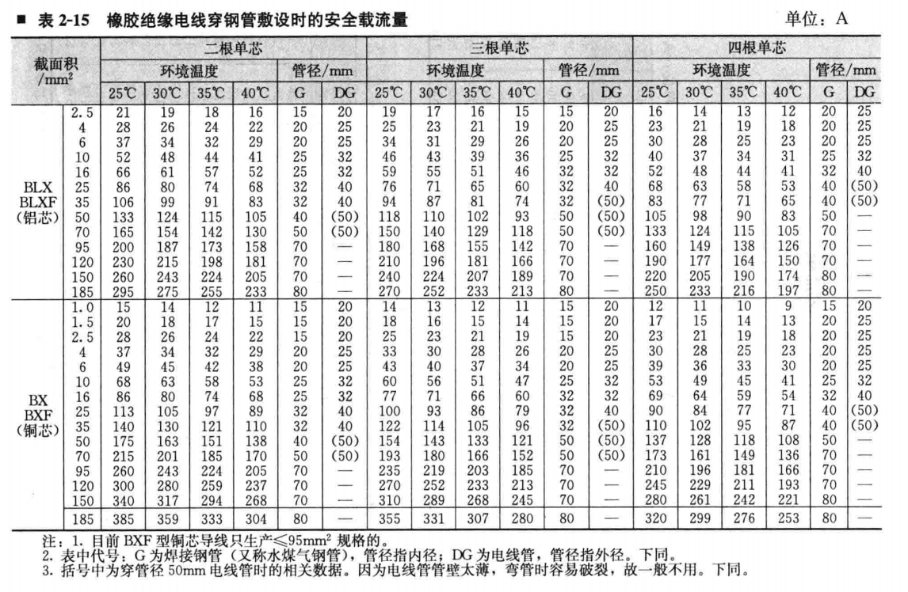
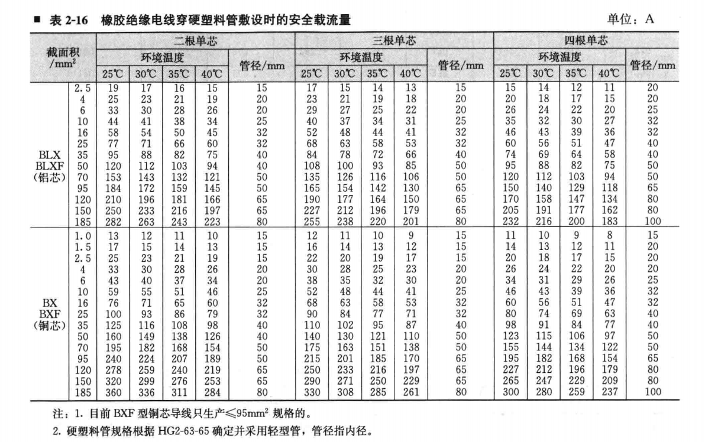
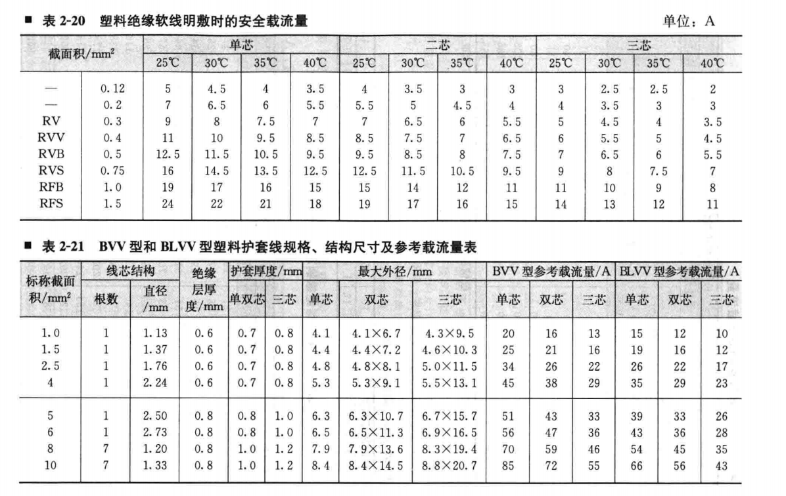
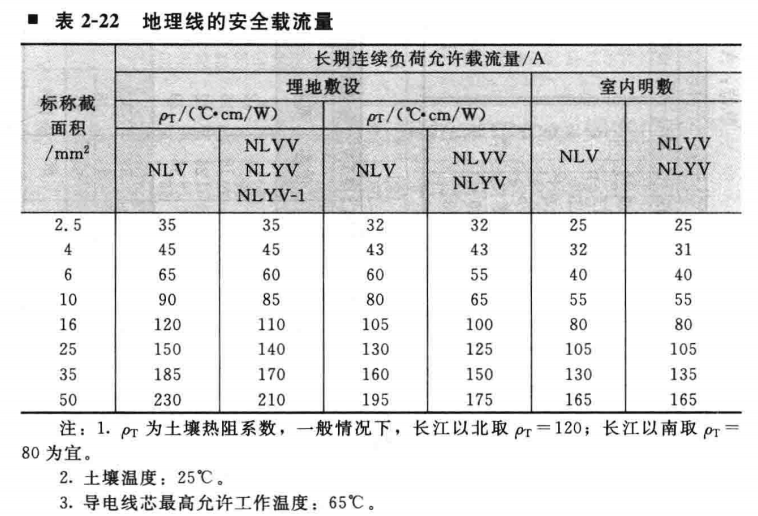
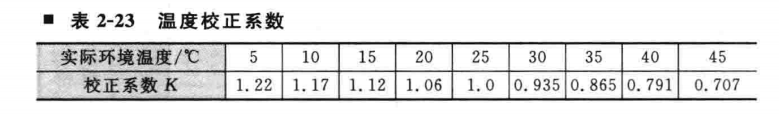
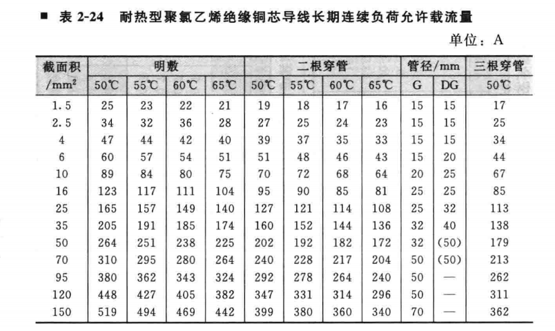
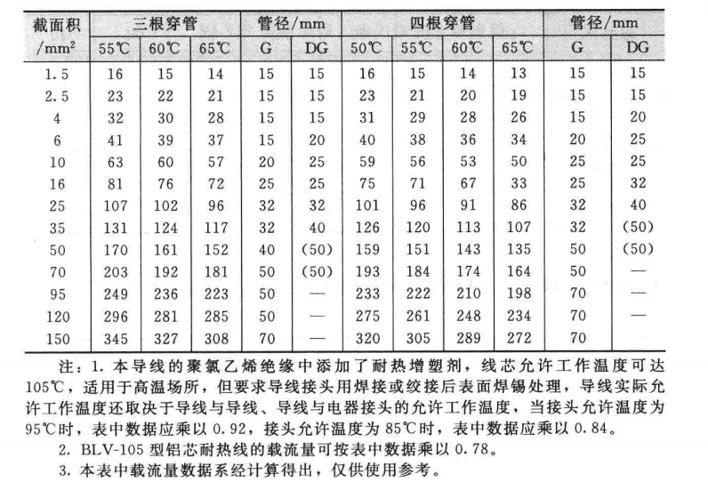
2 电工口诀\
(ps. 铝芯绝缘导线明敷、环境温度为25摄氏度的条件为计算标准，载流量=截面积 乘以 一定倍数) \
10下五，100上2\

25、35、四、三界\
70、95，两倍半\
穿管、温度，八、九折\
(ps. 导线不明敷，温度超过25摄氏度，载流量打八折后再打九折: 0.8*0.9 = 0.72)\
裸线加一半，铜线升级算\
(ps. 铜线截面积按照截面积排列顺序提升一级)

## ref
<最新实用电工手册.pdf>\
<电工基础 微课版>\
<实用电工速查速算手册.pdf>

# 电磁阀
33.5 4V210-08 [以赛亚 电磁阀](https://item.taobao.com/item.htm?spm=a21n57.1.item.2.66ea1b92u2wZmA&priceTId=2150429817207644299582343e3bd4&utparam=%7B%22aplus_abtest%22:%22f069509970c538e5af0666f8014154d5%22%7D&id=550811168935&ns=1&abbucket=9)
