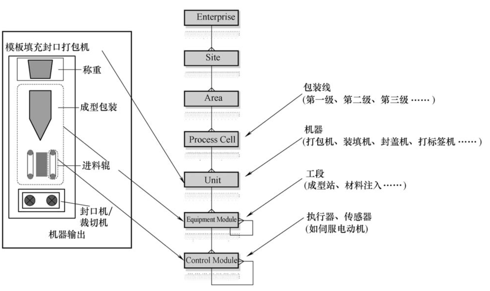
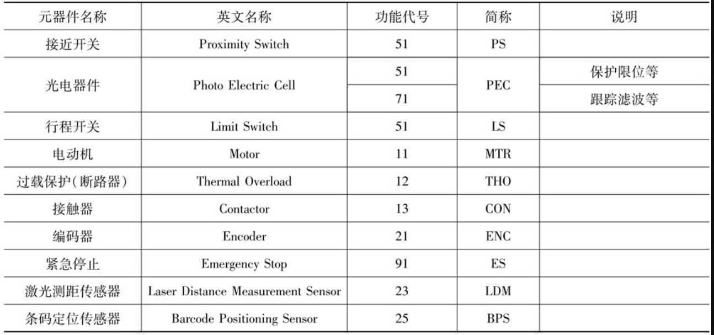
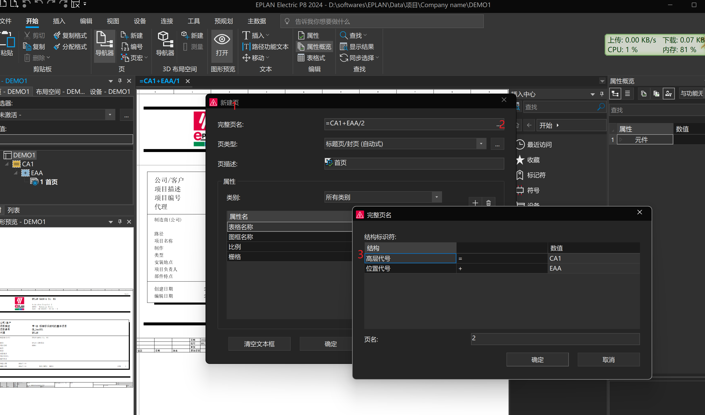

# 电气制图标准
GB/T 4728.x 电气简图用图形符号\
GB/T 6988.x 电气技术用文件的编制\
GB/T 5094.x 工业系统、装置与设备及工业部产品结构原则与参照代号

# eplan
## 命名系统

### process cell
一个process cell有自己的运行模式，可以独立于其他区域启动和停止\
process cell可以启停一个区域的设备\

1 若是一个集成项目，项目中会由不同的PLC区域组成，所以process cell名称可以按照0001依次递增\
2 若是一个大型流水线，里面的设备按照功能不同由PLC控制，则process cell也可以按照0001依次递增\
3 大型项目中的每一个PLC或单体设备PLC，可按照功能+数字的方式命名，比如PK01(Pack)

### unit
unit可以指一个process cell中某一类设备单元(EM)的集合，比如一个分拣项目的输送线\
也可以指一个流水线中的完成过一个功能的EM集合，比如包装设备中的机械臂组件\

unit的ID由两位数据组成，ID号依次由01开始递增\
1 某一部分的设备由一个一个单个EM组成，他们共同完成了一部分功能\
2 还有一部分设备由于功能需要，由多个section组成，比如机械臂，由于行走和升降两部分组成，跟此机械臂有关联的所有section应为一个unit的ID\

### EM
EM是实现基本系统功能的最小机械/软件构建块，即这是执行一个完整工艺的最小部分\
EM的ID由两位数据组成，ID号依次由01开始顺序递增\

1 若EM的unit只是一些相同功能的EM集合，EM的ID从01开始递增\
2 若EM的unit是一个独立功能的设备，因为该功能已经是标准的，所以EM数量不会变化，unit里的EM ID由01开始顺序递增\

### CM
CM是安装在机械对象上的各种传感器和执行器，它们是控制该机械部分所必须的，主要包括电动机、光电器件、接近开关等为工艺而设计的电子元器件\

CM由5位数字和英文字母组成，前面两位表示CM的功能代码，后面三位表示xx元器件

### 对应eplan操作

# ref
<PLC的标准化应用：基于西门子OMAC的面向对象的编程方法>
